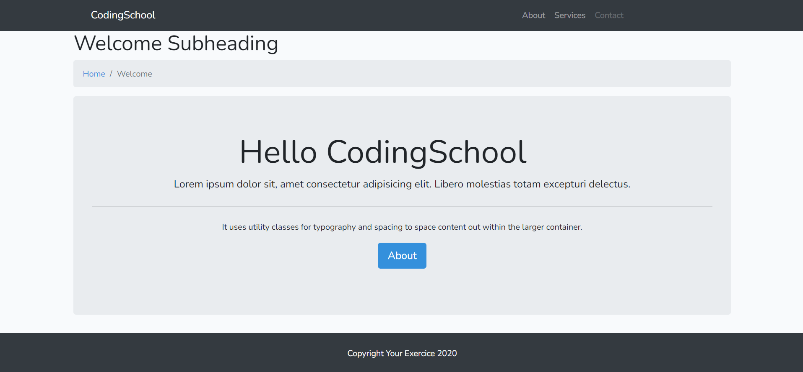
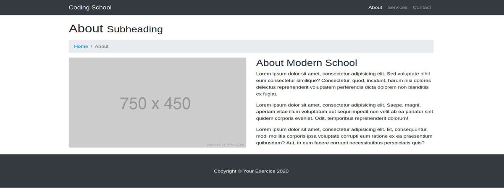
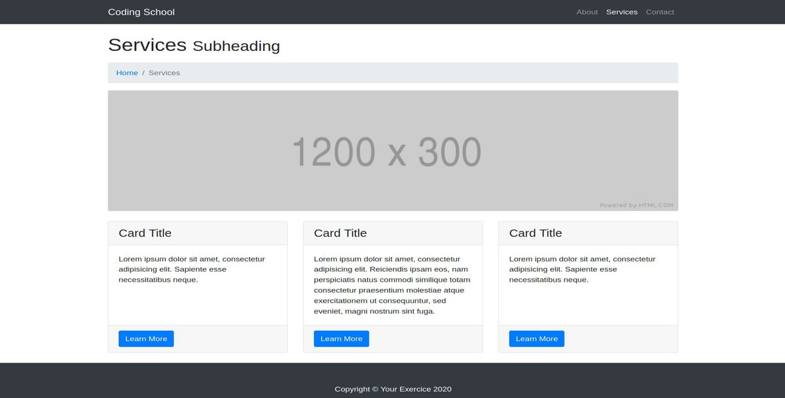

# Extends Yield 2

- reproduire les images en annexe, en utilisant ce qu'on a déjà vu: extends, yields, section, include, variable environnement, bootstrap, les routes etc
- faire un console log('votrePrenom'); dans un fichier js du nom de "perso.js"
- le titre 'coding school' doit être en mauve ( votre propre sass )

## home

## about

## services

