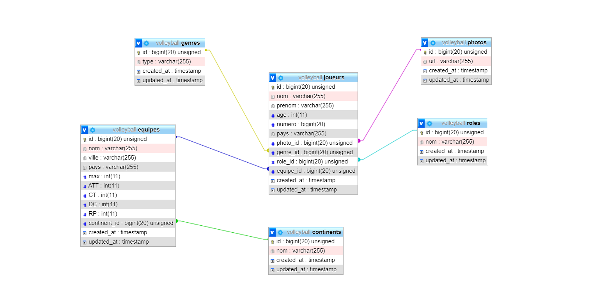

# Foreign key : Exercice Volleyball (One to many + one to one)
`Nom du repo => laravel_volleyball_plateforme`

## Volleyball
Pour une compétition de volleyball, il faut réaliser un site internet (plate-forme), la seule chose qu'on sait c'est que le client veut pouvoir créer des équipes et les modifier.

### 1) Détails téchniques
- Chaque équipes à : 
nom de club, une ville qu'elle représente , un pays et un maximum de joueur possible dans leur équipe et par role (2 avant, 2 centraux, 2 arrière, 3remplacants)*, continent_id (pour déterminer dans quel contient l'équipe joue) 

    exemple :
    MolenVolley, bruxelles, belgique, 12max, europe

- Les joueurs peut être rajoutés dans la plateforme :
un nom , prénom,age, téléphone,email, un genre, un pays d'origine, rôle_id dans une partie ( avant, central, arrière, remplaçant ), une equipe_id et une photo_id

Evidemment une équipe/joueur peut être supprimé, modifié, ajouter (crud complet). Attention, si vous supprimer le joueur, sa photo doit être également supprimé (cascade)
Si l'équipe n'a plus de place dans un poste alors le joueur ne peut pas être rajouter et on reçoit un message pour nous en prévenir (flash)

### 2) Affichages : 
#### Pages all équipes
Il faut une page pour afficher TOUTES les équipes :
nom de l'équipe , ville , nombre de joueurs sur/maximum de place
exemple :
Molenvolley , bruxelles, 5/7max +  un button voir(show)

- dans le show de chaque équipes on peut revoir le nom de l'equipe la ville le nombre de joueurs sur/maximum de place et tous les joueurs qui en font partis juste leur nom prénom et leur role et un button voir qui nous ramène sur le show du joueur pour y voir TOUTES ses informations et même son équipe. ( utiliser les méthode dans les modèles pour récupérer cette information.)

#### pages all joueurs
Il faut une page pour afficher tous les joueurs :

Nom, Prénom, Nom d'équipe + button pour voir le show du joueur
le nom de l'équipe du joueur est cliquable également pour aller voir le show de l'équipe avec toutes les informations !

#### pages home

La page home avec : 
- une section ( équipes remplies )
- une section ( 2 équipes non remplies )
- une section ( 4 joueurs sans équipes au hasard )
- une section ( 4 joueurs avec équipe )
- une section ( les equipes d'europes )
- une section ( les équipes hors europes )
- une section 5 joueuses au hasard qui ont une équipe !
- une section 5 joueurs homme et qui ont une équipe !
 DB informations 
à utiliser -> ralation one to many + one to one
- une table joueur
- une table photo
- une table rôle
- une table équipe
- une table continent
si vous trouvez qu'on peut encore en rajouter, n'hésitez pas

## Pour rappel : 
- template(extends, yield,include etc)
- validates, old, messages flash, ect
- sytème de storage pour img
(mettre tout ce qu'on à vu)

**L'exercice est pour Jeudi à 12h30**

