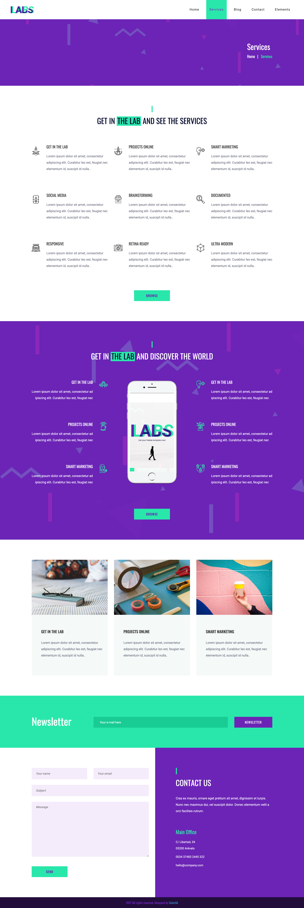

# Le Lab
- 4 pages à intégrer

### Menu navbar
- le menu peut être modifiable (nom de pages)
- ca change les noms des pages automatiquement mais pas l'url.
- l'actif dans l'ul
### Footer
- doit être modifiable

## Home
### banière caroussel
- image en arrière page (supprimer ou ajouter)
- laisser au moins une image
- changer le logo (change aussie celle de la navbar)
- on peut aussi changer la description
### services rapides
- 3 services aléatoires (ce sont les mêmes que services)

### about
- le boutton `browse` doit rediriger vers la section contact en bas et lien modifiable
- on doit pouvoir éditer le titre et mettre une parti en vert avec des parenthèses (the lab) (en php) -> doit être fonctionnel dans tous les titres
- small -> explication dans la back office pour mettre le texte en vert
- deux descriptions
- une vidéo youtube avec une image

### testimonials
- commentaires, photo, nom, post (limité à 6 dans le front end) aléatoire (ajouter, editable, supprimable)
- titre (éditable)
- image avec le gars en costume modifiable (éditable)

### services
- proposer 20 à 30 icones
- 9 services aléatoires
- boutton avec lien modifiable

### team
- ce sont les users
- ceo est toujours centré au milieu les autres c'est aléatoire
- nom, image, et poste
- c'est à nous de choisir le ceo

### ready
- titre à part, description, button

### contact
- côté gauche fonctionnel et côté droit doit être éditable
- doit indiquer que le message à bien été envoyé
- titre, description, main office, address, 

## Service
### services
- c'est un nouveau titre
- afficher avec une pagination quand il y a plus de 9 services
- il y a un style de pagination à intégré
- button redirige vers contact

### servives prime
- titre, image, button
- 6 services primes (ce sont pas les mêmes) aléatoires (une autre table)

### articles
- les 3 derniers articles
- image, titre, un peu du contenu de l'article

### newsletter
- enregistrer les mails (ce mail est déjà enregistré dans la newsletter)
- c'est un crud create
- **à chaque nouvelle article, on doit envoyer un mail à chaque utilisateur enregistré dans la newsletter**
    - les mails formulaire doit être beau

### contact
- la même que dans la section précédante

## Blog
c'est la partie la plus longue
### articles
- image, date, titre, contenue (limité visuellement),  auteur, les catégories, nombres de commentaires
- 3 derniers articles avec un système de pagination
- read more:
    - tout l'article
    - auteur avec description
    - les commentaires (one to many)
    - le formulaire de message
        - afficher un button login
        - juste le message
        - membre de la team peut poster un message
- catégoires
    - many to many
    - quand on appuie sur une catégorie ca affiche tous les articles qui ont le tag
- tags
    - many to many
    - quand on appuie sur un tag ca affiche tous les articles qui ont le tag
- add, quote, instagram à supprimer
- la bare de recherche cherche par rapport au titre

## Contact
### google map
- on peut écrire molengeek dans le back office et ca affiche molengeek
- par défaut liée a l'adresse de contact 
- il faut utliser une autre map

### contact
- la même que dans la section précédante

## Elements
à supprimer

## authentifications
on peut s'inscrire dans le site et à automatiquement un rôle visiteur
### roles
5 roles :
- admin
- webmaster
- rédacteur
- membre
- visiteur

visiteur et membre ne peut rien voir du backoffice (pas accès au dashboard)
l'admin peut gerer les rôles des utilisateurs et supprimer des comptes
le webmaster peut voir les utilisateurs
on peut éditer son profil mais pas obligatoire
image par défaut lors de la création d'un profil

### home et service
admin et webmaster sauf user ou personne peut rien faire

### home et service
admin et webmaster

### articles
- admin et webmaster peut créer un article
- redacteur peut créer un article (pas de modification, suppression) mais s'affiche pas tant que le webmaster/admin n'a pas accepté
- contact par admin et webmaster

### backoffice
- navbar sur le côté
- pas obliger d'avoir un dashboard
- respect des couleurs

## consignes
présentation lundi 5 à 9heures du matin

