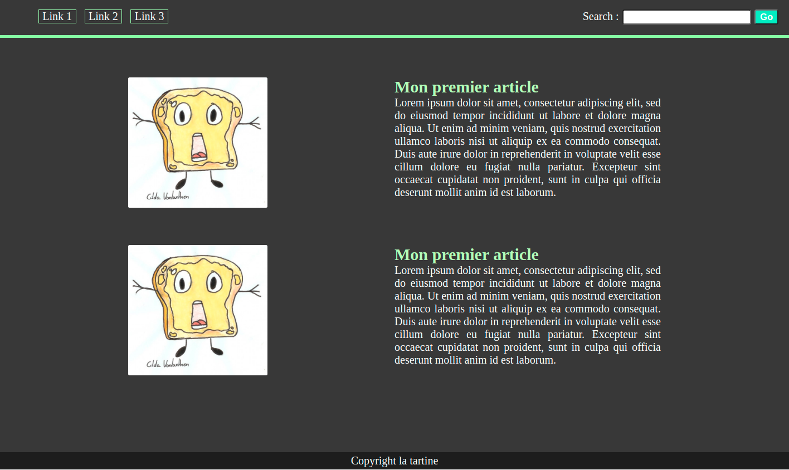

Commencez à écrire ici ...

Reproduit l'image

Consignes :

Créer un nouveau projet et épure le, garde le composant App
Créer les composants suivants :
- Header
- Navigation
- SearchBar
- Body
- Article
- Footer

Chaque composant à son propre fichier cssAttention, ne recrée pas les même class dans plusieurs fichier css suivant, utilise un parent général ou tu y mettra les class qui sont réutilisées. 

Fais cela de la manière la plus optimisée, les composants s'imbrique les uns dans les autres